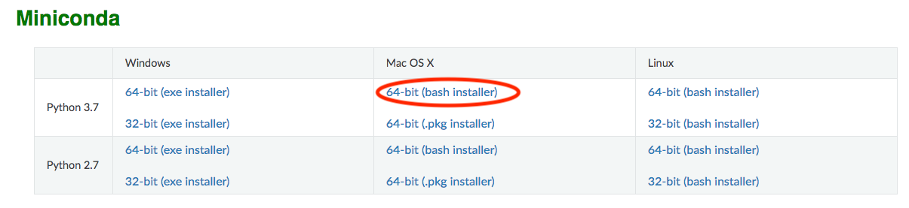
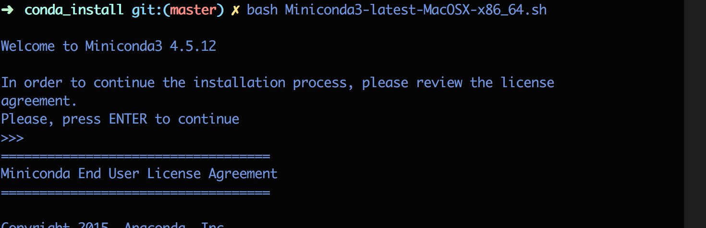
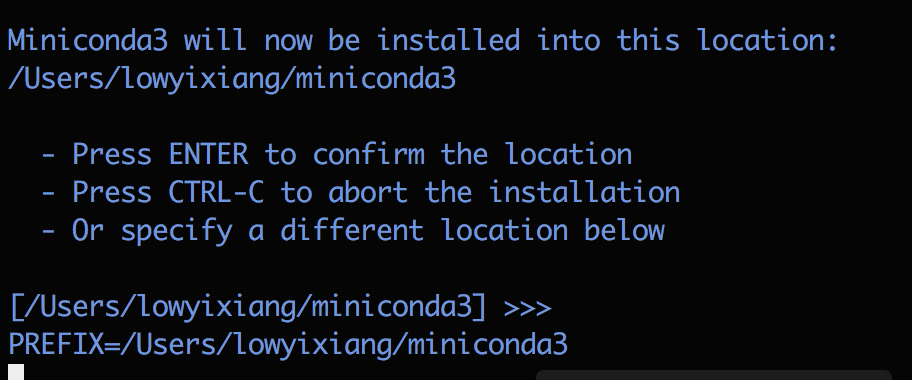
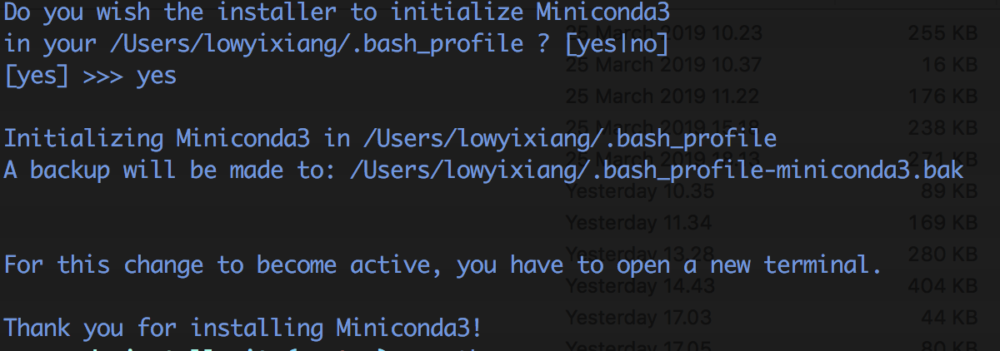
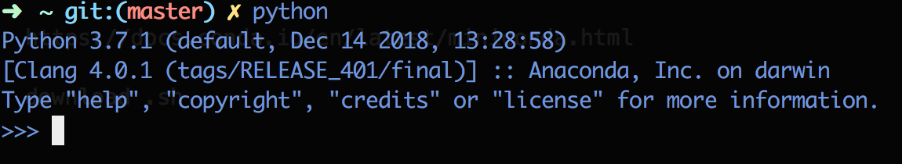

# Installing Miniconda3 on Mac

This guide will mainly be focusing on using the terminal for installation. Note that the integration of git with your device will be beyond the scope of this workshop. You may ignore `git:(master)` at the front of the working directory.

## Download installer

Go to the following [page](https://conda.io/en/latest/miniconda.html) and download `64-bit (Bash installer)`. You should see `Miniconda3-latest-MacOSX-x86_64.sh`

Fire up terminal, and navigate to the directory where you saved the file. For me, i saved it to a subfolder in a folder under my desktop. I run the following command:

`cd $HOME/Desktop/softwares/conda_install`

Run `ls` in the terminal and you should see `Miniconda3-latest-MacOSX-x86_64.sh`. 

## Run installer 

Run `bash Miniconda3-latest-MacOSX-x86_64.sh`. 

Agree to the license and there will be a prompt after pressing enter a couple of times: `Do you accept the license terms? [yes|no]`, enter `yes`.

Result:

During Installation, they will prompt you:

enter `Yes`

## Check installation

Restart (close and open) your terminal window, and type `python`. You should see:

