# Installing Miniconda3 on Windows 10

Follow these instructions to install Miniconda3 on Windows 10.

## Download installer

Go to the following page: [https://conda.io/en/latest/miniconda.html](https://conda.io/en/latest/miniconda.html)

Download the 64-bit (exe installer) for Windows with Python 3.7. 
This assumes that you are running 64-bit version of Windows, which should usually be the case.
We are using Python 3 because this is 2019. 
Python 2 will not be maintained past 1st January 2020, please do not use it anymore.

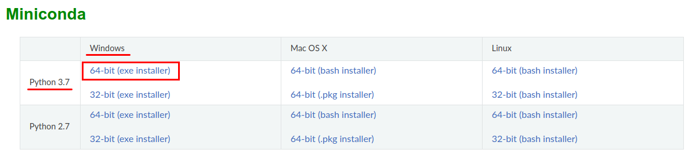

This download link should also work: 
[https://repo.anaconda.com/miniconda/Miniconda3-latest-Windows-x86_64.exe](https://repo.anaconda.com/miniconda/Miniconda3-latest-Windows-x86_64.exe)

## Run the installer

Open the download destination folder and double click on the Miniconda3 installer.
It should be named `Miniconda3-latest-Windows-x86_64.exe`.

Start the installation by clicking `Next`.

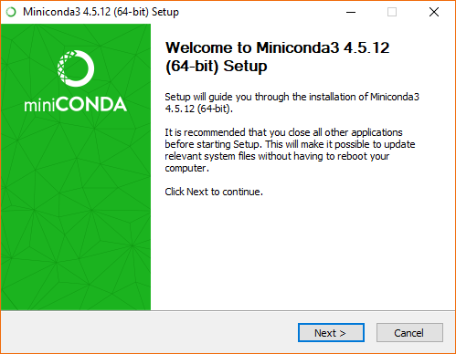

Accept the license agreement with `I Agree`.

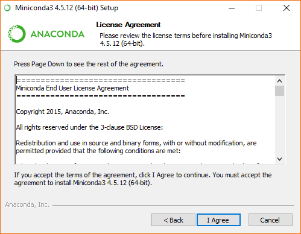

For installation type, select `Just Me (recommended)` and click `Next`.

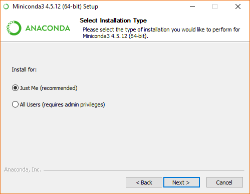

Leave the destination folder as it is, unless you know what you are doing. 
Take note of the path. It should be `C:\Users\<UserName>\Miniconda3`.
Click `Next`.

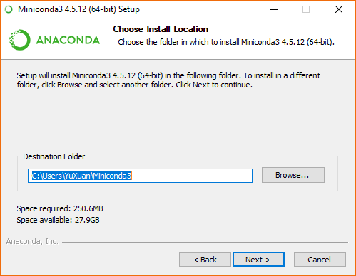

Leave the options as they are. 
Check only the option `Register Anaconda as my default Python 3.7`.
We will add Miniconda3 to the `PATH` environment variable in the next section.
Click `Install`.

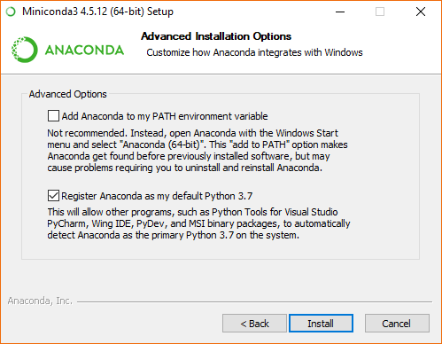

Miniconda3 will begin installation. This may take a few minutes. Please wait patiently.

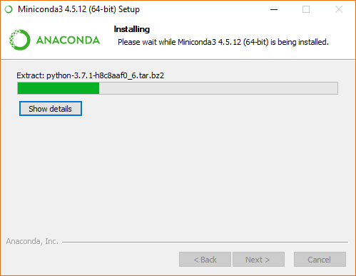

You may click on `Show details` to see what is happening.

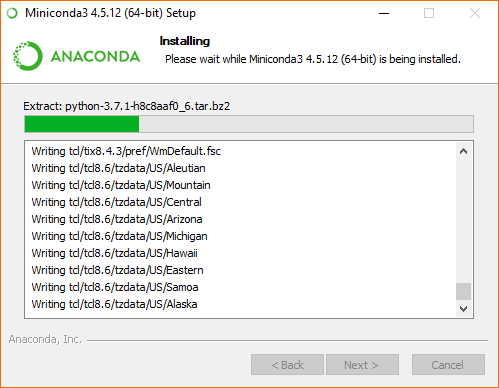

When it is completed, click `Next`.

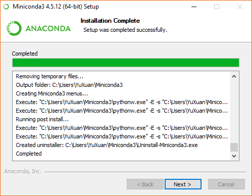

Uncheck both options and click `Finish`.

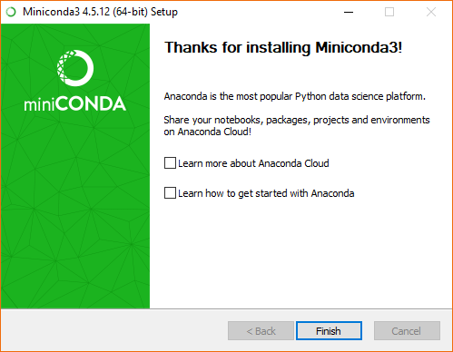

For your reference, below is the complete screen capture of the installation process.


## Add Miniconda3 to `PATH` environment variable

Type `env` in the start menu and click on `Edit the system environment variables` to open `System Properties`. 
Click on `Environment Variables...` in the `Advanced` tab.

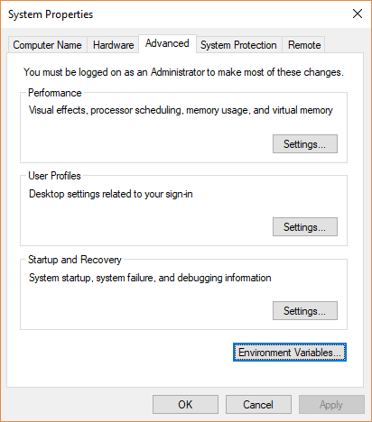

Select `Path` under `User variables` and click `Edit...`.

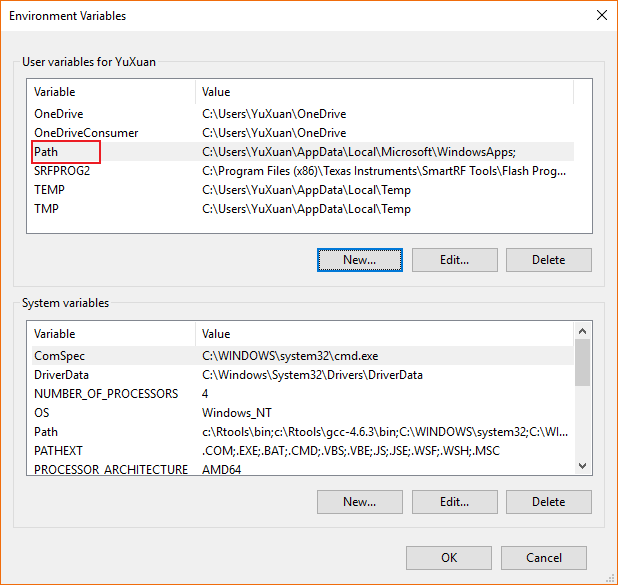

Add the following 3 entries 1-by-1 by clicking `New`. 
`%USERPROFILE%` is a variable that expands into `C:\Users\<UserName>`.
If you have changed the installation destination folder during the installation, please edit the entires accordingly.

```
%USERPROFILE%\Miniconda3
%USERPROFILE%\Miniconda3\Scripts
%USERPROFILE%\Miniconda3\Library\bin
```

Click `OK` to make the changes. 
There may be more entries in your `PATH` environment variable. Please **DO NOT** remove them.

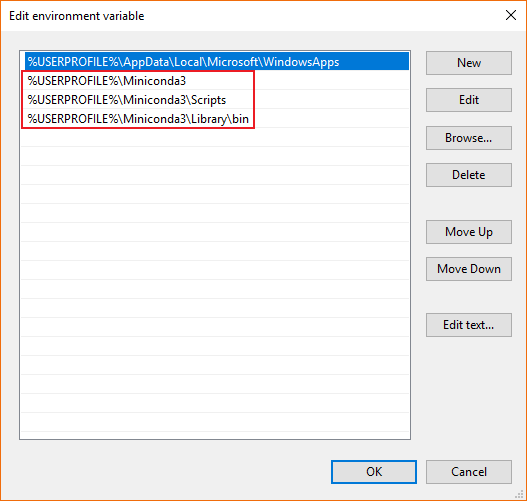

## Check you installation

Type `cmd` in the start menu and start `Command Prompt`. 
You may also use the `Anaconda Prompt`.

Type the following 4 commands. You should see the accompanying outputs.
Take note that the version numbers may be different due to new versions of Miniconda3 and Python.

If you do not see the correct outputs, please refer to the previous section to add Miniconda3 to `PATH` environment variable. 

```
python --version
# Python 3.7.1

where python
# C:\Users\<UserName>\Miniconda3\python.exe

conda --version
# conda 4.5.12

where conda
# C:\Users\<UserName>\Miniconda3\Scripts\conda.exe
# C:\Users\<UserName>\Miniconda3\Library\bin\conda.bat
```

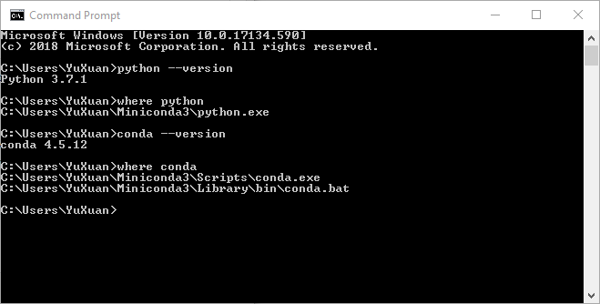

## End

Congratulations, you have completed the installation and may begin your python journey!

## References

- [https://conda.io/projects/conda/en/latest/user-guide/install/windows.html](https://conda.io/projects/conda/en/latest/user-guide/install/windows.html)
- [https://docs.anaconda.com/anaconda/install/windows/](https://docs.anaconda.com/anaconda/install/windows/)
- [https://www.datacamp.com/community/tutorials/installing-anaconda-windows](https://www.datacamp.com/community/tutorials/installing-anaconda-windows)
