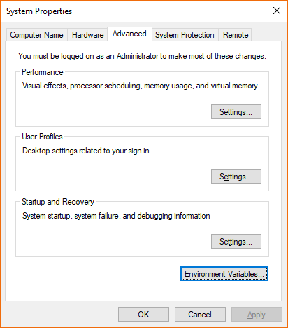
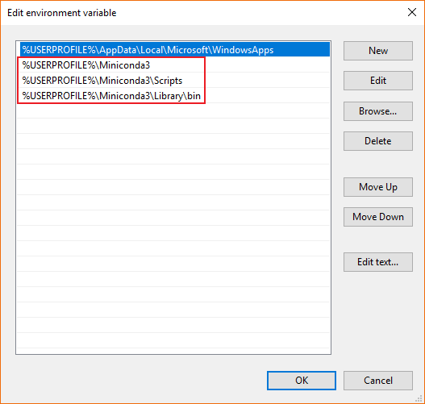

# Uninstalling Miniconda3 on Windows 10

Follow these instructions to uninstall Miniconda3 on Windows 10.

## Run the uninstaller

Open the `Miniconda3` folder. If you have installed it with the default settings, it should be in `C:\Users\<UserName>\Miniconda3`. Double click on `Uninstall-Miniconda3`.


Click `Next`.


Click `Uninstall`.


You may click on `Show details`.


When it is completed, click `Next`.


Click `Finish`.


For your reference, below is the complete screen capture of the uninstallation process.


## Reset the `PATH` environment variable

Type `env` in the start menu and click on `Edit the system environment variables` to open `System Properties`. 
Click on `Environment Variables...` in the `Advanced` tab.



Select `Path` under `User variables` and click `Edit...`.


Remove the following 3 entries 1-by-1 by clicking `Delete`. 
`%USERPROFILE%` is a variable that expands into `C:\Users\<UserName>`.

```
%USERPROFILE%\Miniconda3
%USERPROFILE%\Miniconda3\Scripts
%USERPROFILE%\Miniconda3\Library\bin
```

Click `OK` to make the changes. 
There may be more entries in your `PATH` environment variable. Please **DO NOT** remove them.



You have completed the uninstallation process and reset the environment.
